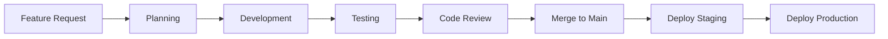
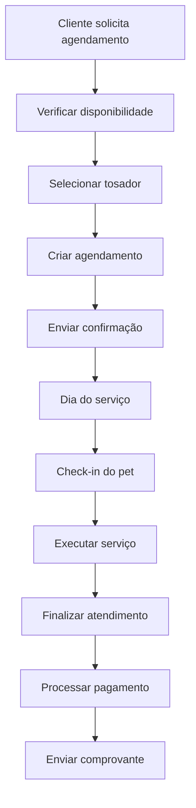
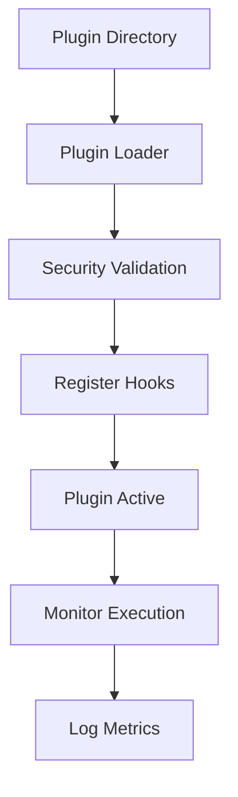

# 📚 Documentação Completa - Furry Friends Agenda

## 🏠 Visão Geral do Projeto

O **Furry Friends Agenda** é uma plataforma completa de gestão para pet shops, desenvolvida com tecnologias modernas e arquitetura escalável. Oferece funcionalidades avançadas de agendamento, financeiro, relatórios e um sistema extensível de plugins.

---

## 📖 Índice da Documentação

### 🏗️ Arquitetura e Design

- **[🏛️ Arquitetura do Sistema](ARCHITECTURE.md)** - Visão completa da arquitetura, componentes e padrões
- **[🏢 Arquitetura Multi-Tenancy](MULTI-TENANCY.md)** - Sistema multi-tenant e isolamento de dados
- **[🔌 Sistema de Plugins](plugins.md)** - Como funciona o sistema de extensibilidade
- **[🔒 Segurança](SECURITY.md)** - Políticas e práticas de segurança

### 💻 Desenvolvimento

- **[🛠️ Guia de Desenvolvimento](DEVELOPMENT.md)** - Setup, padrões e melhores práticas
- **[🚀 Deployment](DEPLOYMENT.md)** - Estratégias de deployment e infraestrutura
- **[📡 API Reference](API.md)** - Documentação completa da API REST

### 📊 Documentos Específicos

- **[💰 Pagamentos](payments.md)** - Sistema de pagamentos e gateways
- **[📈 Diagramas](diagrams.md)** - Diagramas de arquitetura e fluxos
- **[📋 Plano de Implementação](implementation-plan.md)** - Roadmap e próximos passos
- **[📋 Documento Mestre de Funcionalidades](melhorias.md)** - Requisitos detalhados e lógicas de negócio
- **[🤖 Guia Gemini](GEMINI.md)** - Visão geral técnica e setup
- **[🔄 Guia Replit](replit.md)** - Configuração para ambiente Replit
- **[🧪 Guia de Testes](TESTING_GUIDE.md)** - Estratégia completa de testes
- **[🗺️ Roadmap](ROADMAP.md)** - Plano de evolução do produto

---

## 🚀 Início Rápido

### Pré-requisitos

```bash
# Node.js 18+
node --version

# Docker Desktop
docker --version

# Git
git --version
```

### Instalação e Execução

```bash
# 1. Clone o repositório
git clone https://github.com/your-org/furry-friends-agenda.git
cd furry-friends-agenda

# 2. Configure ambiente
cp .env.example .env
# Edite .env com suas configurações

# 3. Inicie todos os serviços (recomendado para desenvolvimento)
docker-compose -f docker-compose.dev.yml up -d

# Acesse:
# Frontend: http://localhost:8080
# Backend API: http://localhost:3333
# Prisma Studio: http://localhost:5555

# Para executar migrações manualmente (quando necessário):
# docker-compose -f docker-compose.dev.yml exec backend npx prisma migrate dev

# Para desenvolvimento local (sem Docker):
# Backend: cd furry-friends-agenda-backend && npm install && npm run start:dev
# Frontend: cd furry-friends-agenda-app && npm install && npm run dev
```

---

## 🏢 Funcionalidades Principais

### 👥 Gestão de Clientes e Pets

- **Cadastro completo** de proprietários e seus pets
- **Histórico detalhado** de serviços realizados
- **Informações médicas** e observações especiais
- **Programa de fidelidade** integrado

### 📅 Sistema de Agendamento

- **Agenda visual** com drag-and-drop
- **Atribuição inteligente** de tosadores
- **Notificações automáticas** via WhatsApp/email
- **Gestão de status** em tempo real

### 💇‍♀️ Gestão de Serviços

- **Catálogo flexível** de serviços oferecidos
- **Precificação dinâmica** por porte/tipo de pet
- **Controle de duração** e recursos necessários
- **Pacotes promocionais**

### 💰 Controle Financeiro

- **Transações automatizadas** a partir de agendamentos
- **Múltiplas formas de pagamento** (dinheiro, cartão, PIX)
- **Relatórios financeiros** detalhados
- **Controle de caixa** e fluxo de caixa

### 🔌 Sistema de Plugins

- **Extensibilidade total** sem modificar código core
- **Plugins pré-instalados** para funcionalidades comuns
- **APIs seguras** para desenvolvimento personalizado
- **Isolamento completo** entre plugins

### 📊 Relatórios e Analytics

- **Dashboards interativos** com KPIs
- **Relatórios customizáveis** por período
- **Análise de performance** por tosador
- **Métricas de negócio** em tempo real

---

## 🛠️ Stack Tecnológico

### Backend

```typescript
// NestJS + TypeScript
- Framework: NestJS
- Linguagem: TypeScript
- ORM: Prisma
- Banco: PostgreSQL
- Autenticação: JWT
- Validação: Class Validator
- Documentação: Swagger
```

### Frontend

```typescript
// React + Vite
- Framework: React 18
- Build: Vite
- Linguagem: TypeScript
- UI: Shadcn/ui + TailwindCSS
- State: Context API + TanStack Query
- Routing: React Router v6
```

### Infraestrutura

```yaml
# Docker + Cloud
- Containerização: Docker
- Orquestração: Docker Compose / Kubernetes
- Banco: PostgreSQL
- Cache: Redis (opcional)
- CDN: CloudFlare / AWS CloudFront
- Monitoring: Prometheus + Grafana
```

---

## 📁 Estrutura do Projeto

```
furry-friends-agenda/
├── 📚 docs/                          # Documentação completa
│   ├── ARCHITECTURE.md              # Arquitetura do sistema
│   ├── API.md                       # Referência da API
│   ├── DEVELOPMENT.md               # Guia de desenvolvimento
│   ├── DEPLOYMENT.md                # Estratégias de deployment
│   ├── SECURITY.md                  # Políticas de segurança
│   └── ...
├── 🚀 furry-friends-agenda-backend/ # Backend (NestJS)
│   ├── src/
│   │   ├── modules/                 # Módulos do negócio
│   │   ├── shared/                  # Código compartilhado
│   │   ├── plugins/                 # Sistema de plugins
│   │   └── main.ts                  # Ponto de entrada
│   ├── prisma/                      # Schema do banco
│   ├── test/                        # Testes
│   └── docker/                      # Configurações Docker
├── 🎨 furry-friends-agenda-app/     # Frontend (React)
│   ├── src/
│   │   ├── components/              # Componentes React
│   │   ├── pages/                   # Páginas da aplicação
│   │   ├── hooks/                   # Hooks customizados
│   │   ├── context/                 # Context providers
│   │   └── services/                # Chamadas de API
│   ├── public/                      # Assets estáticos
│   └── tests/                       # Testes frontend
├── 🔌 plugins/                      # Plugins do sistema
│   └── whatsapp-notifications/      # Plugin de exemplo
├── 🐳 docker-compose.*.yml          # Configurações Docker
└── 📋 package.json                  # Dependências raiz
```

---

## 🔄 Fluxos de Trabalho

### Desenvolvimento



### Agendamento de Serviço



### Sistema de Plugins



---

## 👥 Equipes e Responsabilidades

### 👨‍💻 Desenvolvimento

- **Arquitetura**: Design de sistemas e padrões
- **Backend**: APIs, banco de dados, lógica de negócio
- **Frontend**: Interfaces, UX/UI, responsividade
- **DevOps**: Infraestrutura, CI/CD, monitoramento

### 🎨 Produto

- **Product Manager**: Visão do produto, roadmap
- **UX/UI Designer**: Interfaces e experiência do usuário
- **QA**: Testes e garantia de qualidade

### 🚀 Operações

- **SysAdmin**: Servidores, bancos de dados
- **DevOps**: Deployments, monitoramento
- **Support**: Atendimento aos clientes

---

## 📊 Métricas e KPIs

### Técnicos

- **Performance**: Tempo de resposta < 500ms
- **Disponibilidade**: Uptime > 99.9%
- **Cobertura de Testes**: > 80%
- **Tempo de Build**: < 10 minutos

### de Negócio

- **Usuários Ativos**: Número de pet shops ativos
- **Agendamentos/Mês**: Volume de serviços agendados
- **Taxa de Retenção**: Clientes que retornam
- **Satisfação**: NPS e avaliações

### Plugins

- **Plugins Ativos**: Número de plugins em uso
- **Execuções**: Chamadas de hooks por dia
- **Tempo Médio**: Performance dos plugins

---

## 🔄 Versionamento

### Versionamento Semântico

```
MAJOR.MINOR.PATCH

- MAJOR: Quebra de compatibilidade
- MINOR: Novas funcionalidades
- PATCH: Correções de bugs
```

### Branches

```bash
# Branches principais
main          # Produção
develop       # Desenvolvimento

# Branches de feature
feature/auth-jwt
feature/payment-stripe
feature/plugin-system

# Branches de release
release/v1.0.0
release/v1.1.0

# Branches de hotfix
hotfix/security-patch
hotfix/critical-bug
```

### Tags e Releases

```bash
# Criar tag
git tag -a v1.0.0 -m "Release v1.0.0"

# Push tag
git push origin v1.0.0

# GitHub Release
- Changelog
- Assets (binários)
- Release notes
```

---

## 🤝 Contribuição

### Processo de Contribuição

1. **Fork** o repositório
2. **Clone** sua fork: `git clone https://github.com/your-username/furry-friends-agenda.git`
3. **Crie uma branch**: `git checkout -b feature/nova-funcionalidade`
4. **Commit suas mudanças**: `git commit -m 'feat: add nova funcionalidade'`
5. **Push para sua fork**: `git push origin feature/nova-funcionalidade`
6. **Abra um Pull Request**

### Padrões de Commit

```bash
# Formato: type(scope): description
feat(auth): add JWT authentication
fix(ui): resolve button alignment issue
docs(api): update endpoint documentation
refactor(db): optimize query performance
test(appointments): add unit tests for booking logic
style(components): format code with prettier
chore(deps): update dependencies
```

### Code Review

- **Aprovação obrigatória** de pelo menos 1 reviewer
- **Testes passando** obrigatoriamente
- **Linting** sem erros
- **Documentação** atualizada quando necessário

---

## 📞 Suporte e Contato

### Canais de Suporte

- **📧 Email**: suporte@furryfriends.com
- **💬 Discord**: [Furry Friends Community](https://discord.gg/furryfriends)
- **📚 Documentação**: [docs.furryfriends.com](https://docs.furryfriends.com)
- **🐛 Issues**: [GitHub Issues](https://github.com/furry-friends/furry-friends-agenda/issues)

### Níveis de Suporte

- **Community**: Discord e GitHub Issues (gratuito)
- **Standard**: Email + telefone (assinatura básica)
- **Premium**: Suporte 24/7 + consultoria (assinatura premium)
- **Enterprise**: Suporte dedicado + SLA garantido

### Reportar Bugs

```markdown
## Bug Report Template

**Descrição:**
[Descrição clara do bug]

**Passos para reproduzir:**

1. Vá para '...'
2. Clique em '...'
3. Veja o erro

**Comportamento esperado:**
[O que deveria acontecer]

**Comportamento atual:**
[O que está acontecendo]

**Screenshots:**
[Se aplicável]

**Ambiente:**

- OS: [Windows/Mac/Linux]
- Browser: [Chrome/Firefox/Safari]
- Versão: [1.0.0]
```

---

## 📜 Licença

Este projeto está licenciado sob a **MIT License** - veja o arquivo [LICENSE](LICENSE) para detalhes.

---

## 🙏 Agradecimentos

Agradecemos a todos os contribuidores e à comunidade open source que tornam este projeto possível.

**Última atualização:** Outubro 2025
**Versão da Documentação:** 2.0
