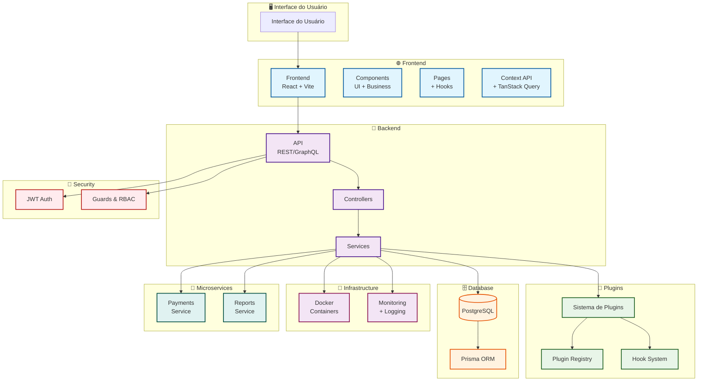
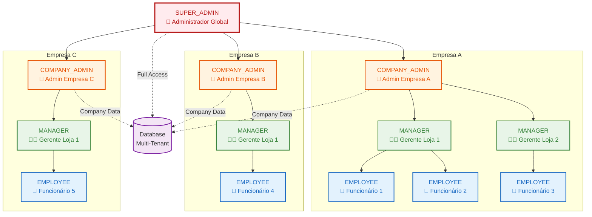
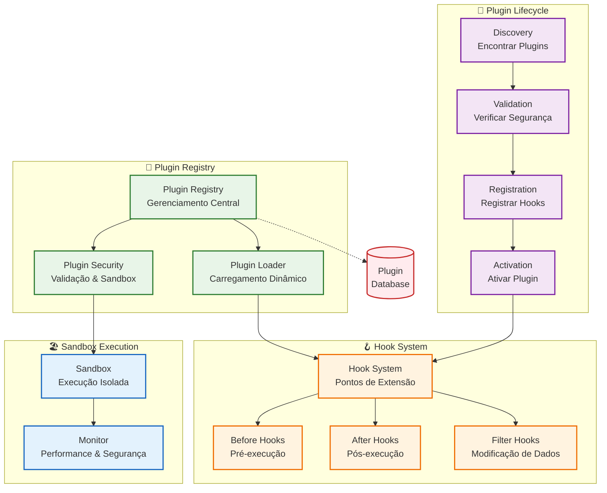
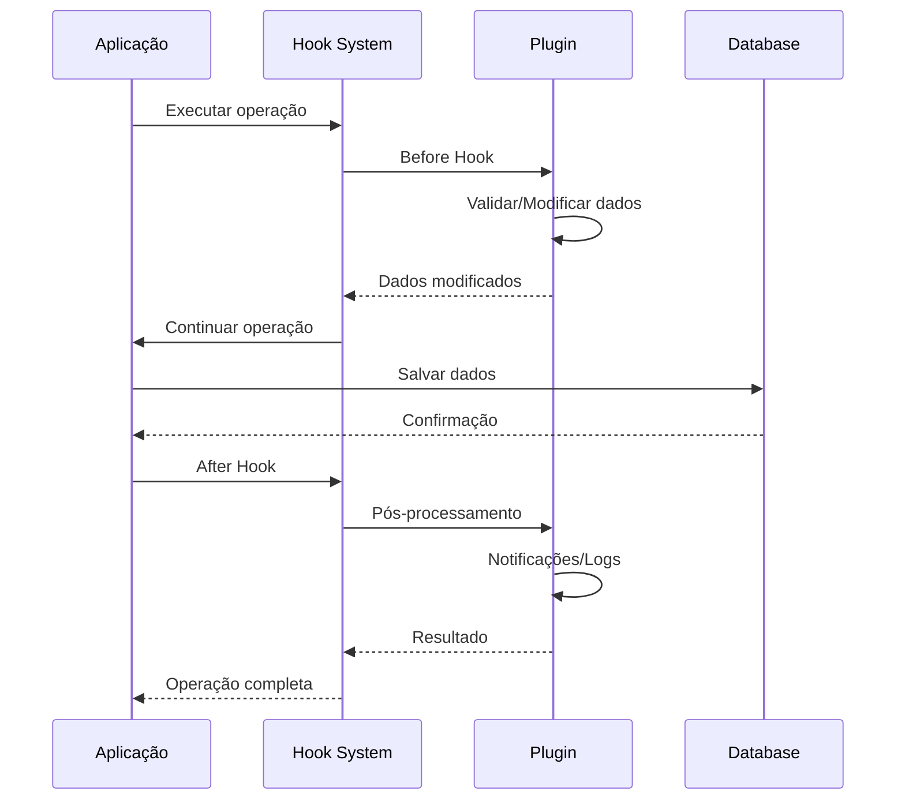
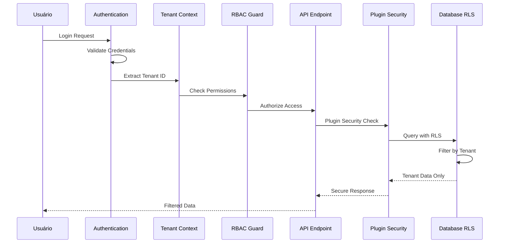
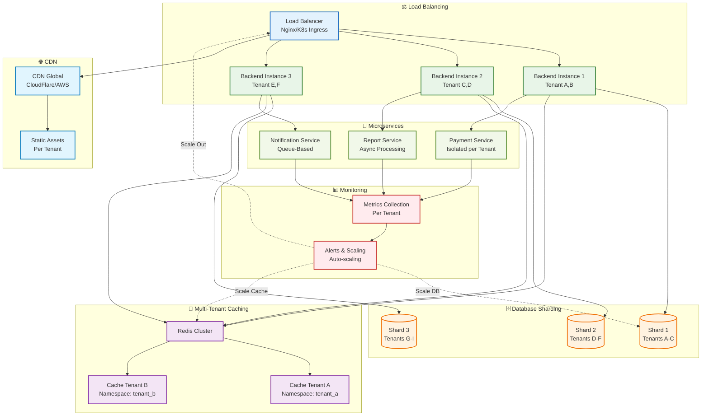
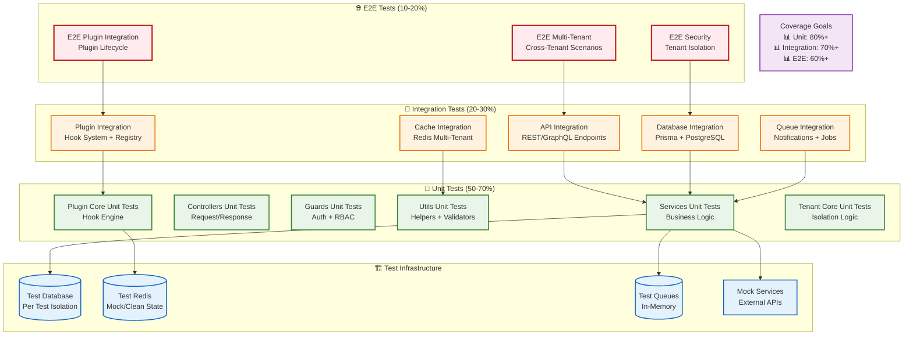

# 🏗️ Arquitetura do Sistema - Furry Friends Agenda

## Visão Geral da Arquitetura

O **Furry Friends Agenda** é uma aplicação full-stack completa para gestão de pet shops, construída com tecnologias modernas e seguindo as melhores práticas de desenvolvimento.

---

## 📊 Arquitetura Geral

### Padrão Arquitetural



---

## 🏢 Hierarquia Multi-Tenant

### Estrutura de Acesso por Níveis



### Isolamento de Dados Multi-Tenant

- **Database Level**: Schema separado por empresa
- **Row Level Security**: Políticas RLS no PostgreSQL
- **Application Level**: Guards e middleware de isolamento
- **Cache Level**: Namespaces isolados por tenant

---

## 🏛️ Componentes da Arquitetura

### 1. 🎨 Frontend - Interface do Usuário

#### Tecnologias

- **Framework**: React 18+ com TypeScript
- **Build Tool**: Vite
- **UI Library**: Shadcn/ui + TailwindCSS
- **State Management**: React Context API + TanStack Query
- **Routing**: React Router v6
- **Forms**: React Hook Form + Zod

#### Estrutura de Diretórios

```
frontend/
├── src/
│   ├── components/          # Componentes reutilizáveis
│   │   ├── ui/             # Componentes base (shadcn)
│   │   ├── forms/          # Formulários específicos
│   │   ├── layout/         # Layout e navegação
│   │   └── business/       # Componentes de negócio
│   ├── pages/              # Páginas da aplicação
│   ├── hooks/              # Hooks customizados
│   ├── context/            # Context providers
│   ├── services/           # Chamadas de API
│   ├── types/              # Definições TypeScript
│   ├── lib/                # Utilitários
│   └── utils/              # Funções auxiliares
├── public/                 # Assets estáticos
├── tests/                  # Testes unitários/e2e
└── docs/                   # Documentação específica
```

#### Padrões de Componentes

- **Atomic Design**: Atoms → Molecules → Organisms → Templates
- **Custom Hooks**: Lógica reutilizável separada dos componentes
- **Compound Components**: Componentes compostos para APIs flexíveis
- **Render Props**: Para compartilhamento de lógica complexa

### 2. 🚀 Backend - API e Lógica de Negócio

#### Tecnologias

- **Framework**: NestJS (Node.js)
- **Linguagem**: TypeScript
- **ORM**: Prisma
- **Banco**: PostgreSQL
- **Autenticação**: JWT + Passport
- **Validação**: Class Validator + Class Transformer
- **Documentação**: Swagger/OpenAPI

#### Estrutura de Diretórios

```
backend/
├── src/
│   ├── modules/            # Módulos do NestJS
│   │   ├── auth/          # Autenticação
│   │   ├── users/         # Gestão de usuários
│   │   ├── clients/       # Gestão de clientes
│   │   ├── pets/          # Gestão de pets
│   │   ├── appointments/  # Agendamentos
│   │   ├── services/      # Serviços oferecidos
│   │   ├── financial/     # Financeiro
│   │   ├── reports/       # Relatórios
│   │   ├── notifications/ # Notificações
│   │   └── plugins/       # Sistema de plugins
│   ├── shared/            # Código compartilhado
│   │   ├── decorators/   # Decorators customizados
│   │   ├── guards/       # Guards de segurança
│   │   ├── interceptors/ # Interceptors
│   │   ├── filters/      # Exception filters
│   │   ├── pipes/        # Pipes de validação
│   │   └── utils/        # Utilitários
│   ├── config/           # Configurações
│   ├── types/            # Tipos TypeScript
│   └── main.ts           # Ponto de entrada
├── prisma/               # Schema do banco
├── test/                 # Testes
└── docs/                 # Documentação da API
```

#### Padrões Arquiteturais

- **Clean Architecture**: Separação clara de responsabilidades
- **Dependency Injection**: Injeção de dependências do NestJS
- **Repository Pattern**: Abstração do acesso a dados
- **CQRS**: Command Query Responsibility Segregation (opcional)
- **Event Sourcing**: Para auditoria e rastreabilidade

### 3. 🗄️ Banco de Dados

#### Modelo de Dados

```prisma
// Usuários e Autenticação
model User {
  id        String   @id @default(cuid())
  email     String   @unique
  password  String
  name      String?
  role      UserRole @default(USER)
  createdAt DateTime @default(now())
  updatedAt DateTime @updatedAt
}

// Clientes e Pets
model Client {
  id           String   @id @default(cuid())
  name         String
  phone        String?
  email        String?  @unique
  address      String?
  pets         Pet[]
  appointments Appointment[]
  createdAt    DateTime @default(now())
  updatedAt    DateTime @updatedAt
}

model Pet {
  id           String     @id @default(cuid())
  name         String
  species      String
  breed        String?
  birthDate    String?
  clientId     String
  client       Client     @relation(fields: [clientId], references: [id])
  appointments Appointment[]
  createdAt    DateTime   @default(now())
  updatedAt    DateTime   @updatedAt
}

// Agendamentos e Serviços
model ServicePackage {
  id          String   @id @default(cuid())
  name        String   @unique
  description String?
  price       Float
  durationMin Int
  createdAt   DateTime @default(now())
  updatedAt   DateTime @updatedAt
}

model Appointment {
  id            String            @id @default(cuid())
  dateTime      DateTime
  status        AppointmentStatus @default(SCHEDULED)
  notes         String?
  totalPrice    Float
  clientId      String
  client        Client            @relation(fields: [clientId], references: [id])
  petId         String
  pet           Pet               @relation(fields: [petId], references: [id])
  groomerId     String?
  groomer       Groomer?          @relation(fields: [groomerId], references: [id])
  createdAt     DateTime          @default(now())
  updatedAt     DateTime          @updatedAt
}

// Financeiro
model Transaction {
  id          String          @id @default(cuid())
  type        TransactionType
  amount      Float
  description String
  date        DateTime        @default(now())
  categoryId  String
  category    FinancialCategory @relation(fields: [categoryId], references: [id])
  createdAt   DateTime        @default(now())
  updatedAt   DateTime        @updatedAt
}

// Sistema de Plugins
model Plugin {
  id          String      @id @default(cuid())
  name        String      @unique
  version     String
  description String?
  author      String
  isActive    Boolean     @default(false)
  isInstalled Boolean     @default(false)
  config      Json?
  permissions Json?
  createdAt   DateTime    @default(now())
  updatedAt   DateTime    @updatedAt
}
```

#### Estratégias de Indexação

- Índices compostos para consultas frequentes
- Índices parciais para status específicos
- Índices de texto completo para buscas
- Índices de data para relatórios temporais

### 4. 🔌 Sistema de Plugins

#### Arquitetura de Extensibilidade



### Fluxo de Dados nos Plugins



#### Ciclo de Vida dos Plugins

1. **Discovery**: Sistema encontra plugins disponíveis
2. **Loading**: Carregamento dinâmico do código
3. **Validation**: Verificação de segurança e compatibilidade
4. **Registration**: Registro no sistema com hooks
5. **Activation**: Ativação e execução de hooks
6. **Monitoring**: Monitoramento de performance e erros

### 5. 🔐 Segurança

#### Camadas de Segurança Multi-Tenant

```mermaid
graph TD
    %% Application Layer
    subgraph "🌐 Application Layer"
        Auth[JWT Authentication<br/>+ Refresh Tokens]
        Guards[Role-Based Guards<br/>RBAC + Multi-Tenant]
        TenantIsolation[Tenant Isolation<br/>Context Middleware]
    end

    %% API Layer
    subgraph "🔌 API Layer"
        Validation[Input Validation<br/>Class Validator + Zod]
        RateLimit[Rate Limiting<br/>Por Tenant/IP]
        CORS[CORS Configuration<br/>Tenant-Specific]
    end

    %% Plugin Security
    subgraph "🔌 Plugin Security"
        PluginValidation[Plugin Validation<br/>Sandbox Execution]
        PermissionCheck[Permission Checks<br/>Hook-Level Security]
        AuditTrail[Audit Trail<br/>Plugin Actions]
    end

    %% Database Layer
    subgraph "🗄️ Database Layer"
        RowLevel[Row Level Security<br/>PostgreSQL RLS]
        Encryption[Data Encryption<br/>Sensitive Fields]
        BackupSecurity[Backup Security<br/>Encrypted Backups]
    end

    %% Infrastructure
    subgraph "🏗️ Infrastructure"
        NetworkSec[Network Security<br/>Firewalls + VPN]
        ContainerSec[Container Security<br/>Image Scanning]
        Secrets[Secrets Management<br/>Vault/Key Management]
    end

    %% Conexões
    Auth --> Guards
    Guards --> TenantIsolation
    TenantIsolation --> Validation
    Validation --> RateLimit
    RateLimit --> CORS
    CORS --> PluginValidation
    PluginValidation --> PermissionCheck
    PermissionCheck --> AuditTrail
    AuditTrail --> RowLevel
    RowLevel --> Encryption
    Encryption --> BackupSecurity
    BackupSecurity --> NetworkSec
    NetworkSec --> ContainerSec
    ContainerSec --> Secrets

    %% External Threats
    Threats[External Threats<br/>🔴 SQL Injection<br/>🔴 XSS<br/>🔴 CSRF<br/>🔴 DDoS]
    Threats -.->|Blocked by| Auth
    Threats -.->|Blocked by| Validation
    Threats -.->|Blocked by| NetworkSec

    %% Estilos
    classDef app fill:#e3f2fd,stroke:#1565c0,stroke-width:2px
    classDef api fill:#e8f5e8,stroke:#2e7d32,stroke-width:2px
    classDef plugin fill:#fff3e0,stroke:#ef6c00,stroke-width:2px
    classDef db fill:#f3e5f5,stroke:#7b1fa2,stroke-width:2px
    classDef infra fill:#ffebee,stroke:#c62828,stroke-width:2px
    classDef threat fill:#ffcdd2,stroke:#b71c1c,stroke-width:3px,stroke-dasharray: 5 5

    class Auth,Guards,TenantIsolation app
    class Validation,RateLimit,CORS api
    class PluginValidation,PermissionCheck,AuditTrail plugin
    class RowLevel,Encryption,BackupSecurity db
    class NetworkSec,ContainerSec,Secrets infra
    class Threats threat
```



### Fluxo de Segurança Multi-Tenant



#### Estratégias de Segurança

- **Autenticação JWT** com refresh tokens
- **Role-Based Access Control (RBAC)**
- **Input Validation** com sanitização
- **Rate Limiting** para proteção contra ataques
- **CORS** configurado adequadamente
- **Helmet** para headers de segurança
- **Encryption** de dados sensíveis

### 6. 📊 Monitoramento e Observabilidade

#### Métricas Coletadas

- **Performance**: Tempo de resposta, throughput, latência
- **Errors**: Taxa de erro, tipos de erro, stack traces
- **Business**: Conversões, retenção, uso de features
- **System**: CPU, memória, disco, rede
- **Plugins**: Execução de hooks, erros de plugins

#### Ferramentas

- **Logging**: Winston com rotação de logs
- **Metrics**: Prometheus + Grafana
- **Tracing**: OpenTelemetry
- **Health Checks**: Endpoints de saúde
- **Alerts**: Notificações automáticas

---

## 🚀 Estratégias de Deployment

### Desenvolvimento

```yaml
# docker-compose.dev.yml
version: "3.8"
services:
  db:
    image: postgres:15-alpine
    environment:
      POSTGRES_DB: furry_friends_dev

  backend:
    build:
      context: ./furry-friends-agenda-backend
      target: development
    volumes:
      - ./furry-friends-agenda-backend:/app
    environment:
      NODE_ENV: development

  frontend:
    build:
      context: ./furry-friends-agenda-app
      target: development
    volumes:
      - ./furry-friends-agenda-app:/app
```

### Produção

```yaml
# docker-compose.prod.yml
version: "3.8"
services:
  db:
    image: postgres:15-alpine
    environment:
      POSTGRES_DB: furry_friends_prod
    volumes:
      - postgres_data:/var/lib/postgresql/data

  backend:
    image: furry-friends-backend:latest
    environment:
      NODE_ENV: production
    depends_on:
      - db

  frontend:
    image: furry-friends-frontend:latest
    depends_on:
      - backend

  nginx:
    image: nginx:alpine
    ports:
      - "80:80"
      - "443:443"
    volumes:
      - ./nginx.conf:/etc/nginx/nginx.conf
```

### Estratégias de Escalabilidade Multi-Tenant



### Estratégias de Escalabilidade por Camada

- **Application Layer**: Horizontal scaling com múltiplas instâncias
- **Database Layer**: Sharding por tenant com read replicas
- **Cache Layer**: Redis cluster com namespaces por tenant
- **Storage Layer**: CDN para assets, S3 buckets isolados
- **Queue Layer**: Filas separadas por tenant/criticalidade
- **Monitoring Layer**: Métricas isoladas com alertas automáticos

---

## 🔄 Padrões de Comunicação

### Entre Microsserviços

- **REST APIs** para comunicação síncrona
- **Message Queues** (RabbitMQ/Redis) para assíncrona
- **WebSockets** para tempo real
- **GraphQL** para queries complexas (opcional)

### Protocolos de API

```typescript
// REST Endpoints
GET    /api/clients           # Listar clientes
POST   /api/clients           # Criar cliente
GET    /api/clients/:id       # Obter cliente
PUT    /api/clients/:id       # Atualizar cliente
DELETE /api/clients/:id       # Remover cliente

// WebSocket Events
client.created
appointment.scheduled
payment.completed
notification.sent
```

---

## 📈 Estratégias de Performance

### Otimizações Frontend

- **Code Splitting**: Lazy loading de rotas
- **Bundle Analysis**: Identificação de pacotes grandes
- **Image Optimization**: WebP, lazy loading
- **Caching**: Service Worker para PWA
- **CDN**: Distribuição global de assets

### Otimizações Backend

- **Database Indexing**: Índices estratégicos
- **Query Optimization**: N+1 queries prevention
- **Caching**: Redis para dados frequentes
- **Connection Pooling**: Prisma connection pool
- **Async Processing**: Filas para tarefas pesadas

### Otimizações de Banco

- **Read Replicas**: Para consultas de leitura
- **Partitioning**: Por data/tipo de dados
- **Archiving**: Dados históricos
- **Backup Strategy**: Incremental + full backups

---

## 🧪 Estratégias de Teste

### Pirâmide de Testes Multi-Tenant



### Tipos de Teste

- **Unit Tests**: Funções, classes, métodos isolados
- **Integration Tests**: Módulos trabalhando juntos
- **E2E Tests**: Fluxos completos do usuário
- **Performance Tests**: Load testing, stress testing
- **Security Tests**: Penetration testing, vulnerability scanning

### Ferramentas de Teste

- **Frontend**: Vitest, React Testing Library, Playwright
- **Backend**: Jest, Supertest
- **Database**: TestContainers
- **E2E**: Cypress, Playwright

---

## 📚 Padrões de Documentação

### Estrutura da Documentação

```
docs/
├── README.md              # Visão geral do projeto
├── ARCHITECTURE.md        # Esta documentação
├── API.md                 # Documentação da API
├── DEVELOPMENT.md         # Guia de desenvolvimento
├── DEPLOYMENT.md          # Guia de deployment
├── SECURITY.md            # Políticas de segurança
├── plugins/               # Documentação de plugins
├── diagrams/              # Diagramas de arquitetura
└── CHANGELOG.md           # Histórico de mudanças
```

### Padrões de Documentação

- **README-Driven Development**: Documentação primeiro
- **Living Documentation**: Sempre atualizada
- **API Documentation**: OpenAPI/Swagger
- **Code Comments**: JSDoc/TSDoc
- **Architecture Decision Records**: Decisões documentadas

---

## 🎯 Conclusão

Esta arquitetura fornece uma base sólida e escalável para o **Furry Friends Agenda**, combinando:

- **🏗️ Arquitetura Modular**: Fácil manutenção e extensão
- **🔒 Segurança Robusta**: Proteção em múltiplas camadas
- **📈 Escalabilidade**: Suporte a crescimento
- **🧪 Testabilidade**: Código bem testado
- **📊 Observabilidade**: Monitoramento completo
- **🔌 Extensibilidade**: Sistema de plugins poderoso

A arquitetura segue as melhores práticas da indústria e está preparada para evoluir conforme as necessidades do negócio crescem.

---

**Última atualização:** Outubro 2025
**Versão da Arquitetura:** 2.0
