# Diagramas de Arquitetura

## Visão Geral da Arquitetura

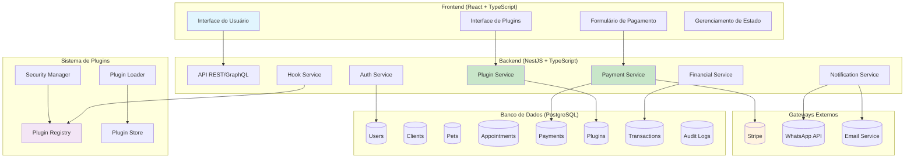

## Fluxo de Pagamento Completo

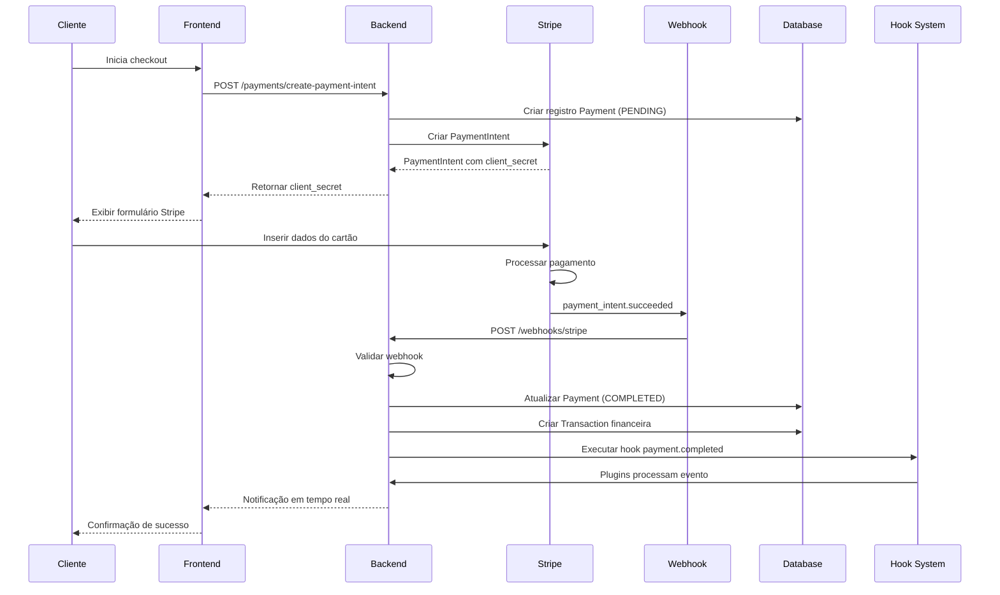

## Arquitetura de Plugins Detalhada

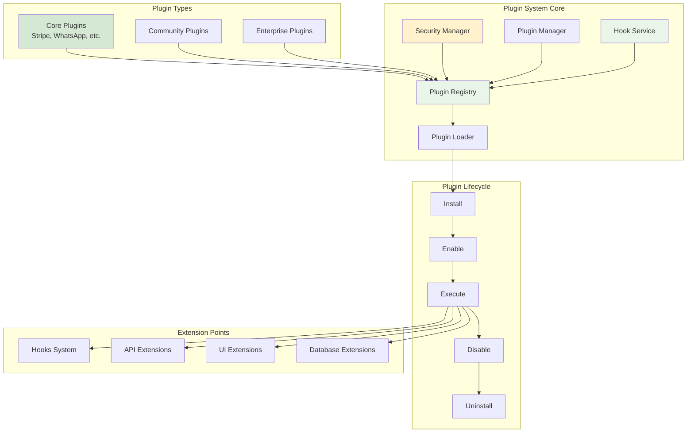

## Fluxo de Plugin

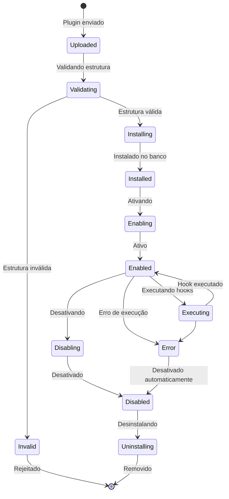

## Integração Frontend-Backend

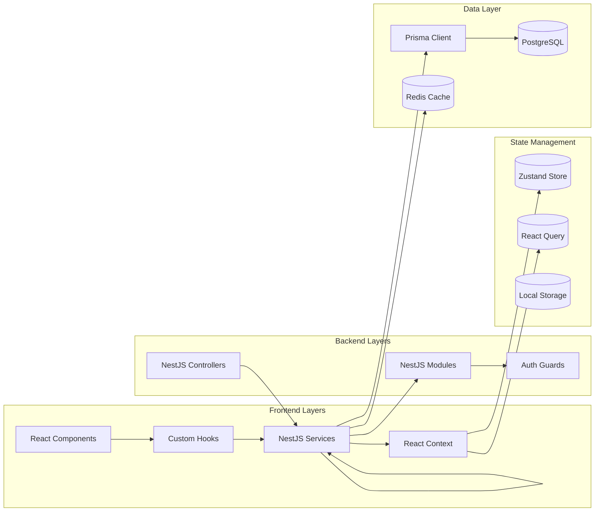

## Sistema de Hooks

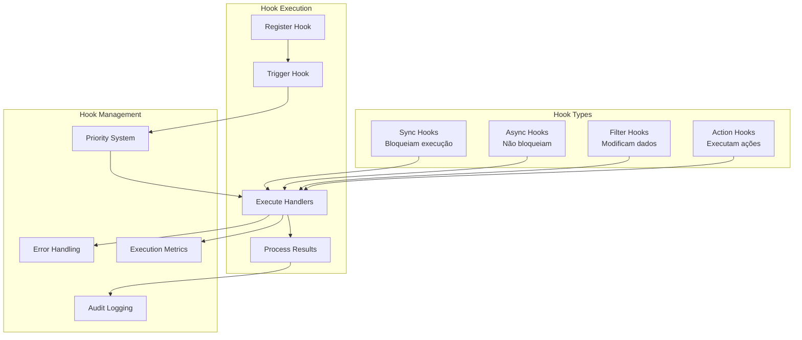

## Modelo de Dados - Relacionamentos

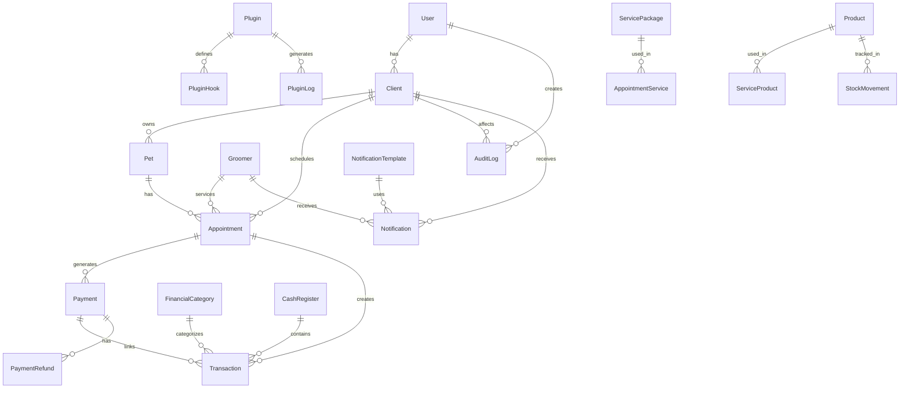

## Fluxo de Autenticação e Autorização

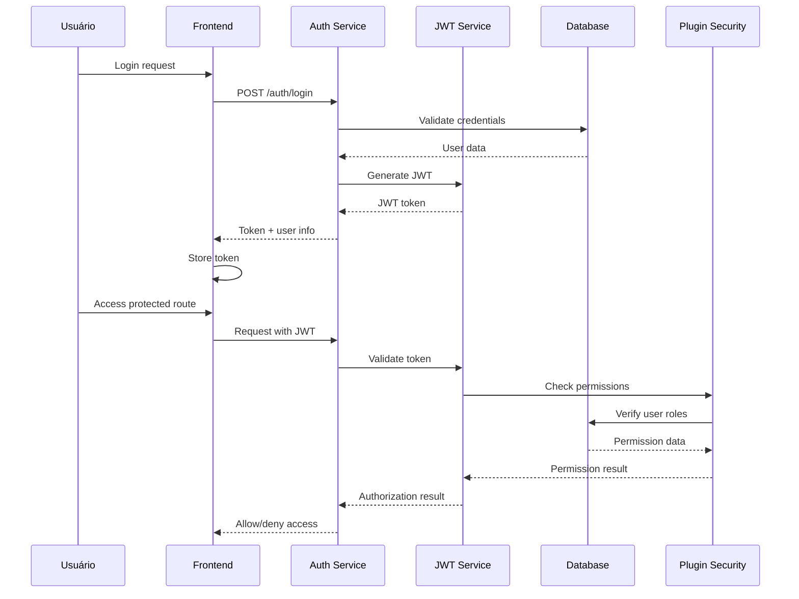

## Pipeline de Processamento de Plugins

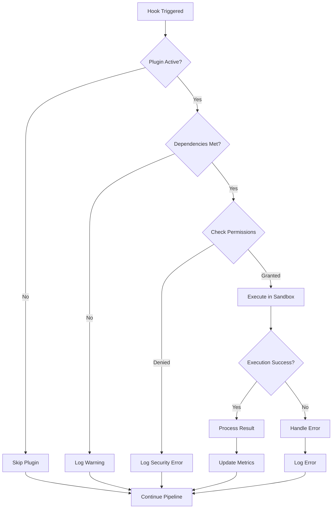

## Dashboard de Métricas

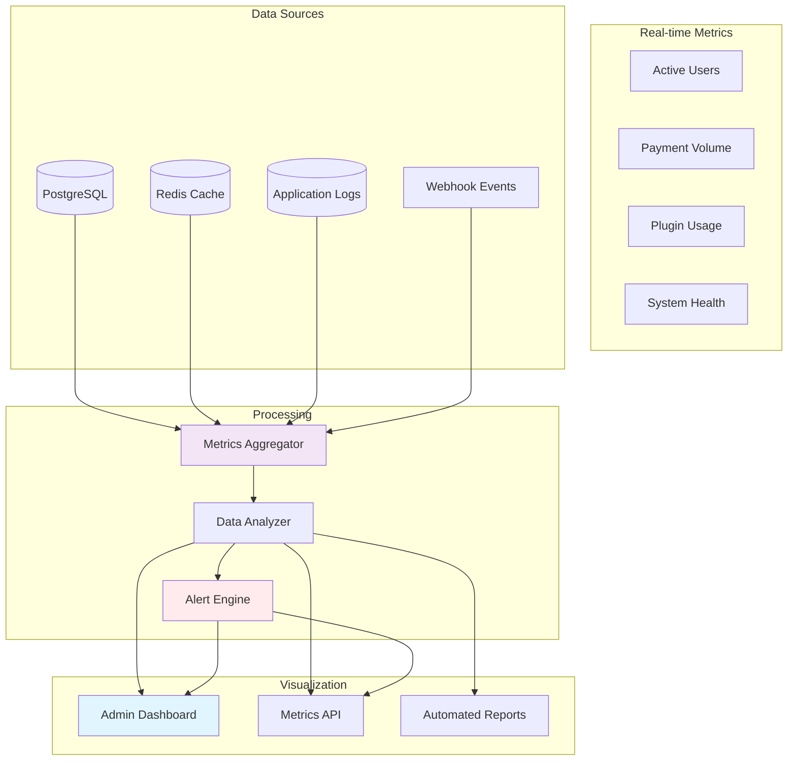

## Estratégia de Deploy

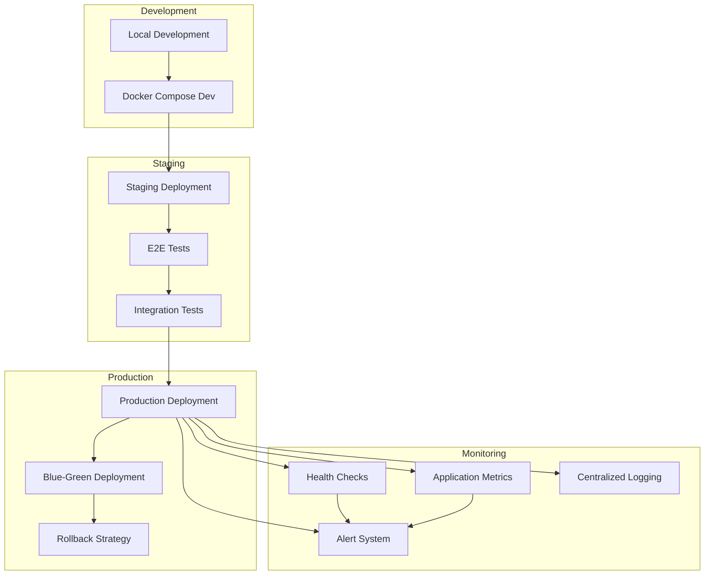

---

## Glossário de Diagramas

### Tipos de Fluxo

- **Sequence Diagrams**: Mostram interações entre componentes ao longo do tempo
- **Flow Charts**: Ilustram processos e decisões
- **Entity Relationship**: Demonstram relacionamentos entre dados
- **State Diagrams**: Representam estados e transições
- **Architecture Diagrams**: Visão geral da estrutura do sistema

### Convenções de Cores

- 🔵 **Azul**: Componentes principais do sistema
- 🟢 **Verde**: Serviços e lógica de negócio
- 🟡 **Amarelo**: Integrações externas
- 🟣 **Roxo**: Sistema de plugins
- 🔴 **Vermelho**: Alertas e tratamento de erros
- ⚪ **Branco**: Estados neutros ou dados

### Níveis de Abstração

- **Nível 1**: Visão geral do sistema
- **Nível 2**: Detalhes de componentes específicos
- **Nível 3**: Implementação técnica detalhada

---

**Última atualização:** Outubro 2025
