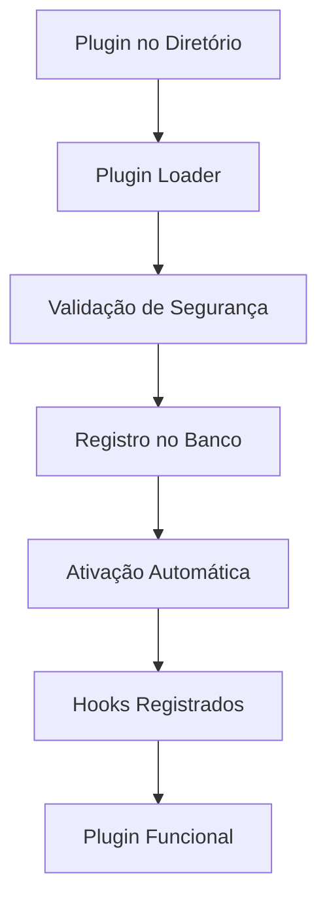

# Sistema de Plugins - Furry Friends Agenda

## Visão Geral

O sistema de plugins permite estender as funcionalidades do Furry Friends Agenda de forma **modular e segura**, sem modificar o código principal da aplicação. Os plugins são **pré-instalados** e **ativados automaticamente** pelo administrador, sem necessidade de download manual.

## 🎯 Modelo de Negócio

### Plugins Inclusos (Pago)

- **WhatsApp Notifications** - Notificações automáticas
- **Stripe Payments** - Processamento de pagamentos
- **Advanced Reports** - Relatórios avançados
- **Loyalty Program** - Programa de fidelidade
- **Inventory Management** - Controle de estoque

### Plugins Personalizados (Desenvolvimento)

- Plugins sob medida para necessidades específicas
- Desenvolvimento por programadores certificados
- Suporte e manutenção incluídos

## 🏗️ Arquitetura

### Componentes Principais

1. **Plugin Registry** - Gerencia o ciclo de vida dos plugins
2. **Hook System** - Sistema de eventos para comunicação
3. **Security Layer** - Camada de segurança e isolamento
4. **Plugin Loader** - Carrega plugins dinamicamente

### Fluxo de Ativação



## 🔧 Como Funciona (Para Administradores)

### Ativação de Plugins

1. **Plugins Pré-instalados**: Todos os plugins vêm com o sistema
2. **Ativação Simples**: Um clique na interface administrativa
3. **Configuração**: Formulário visual para configurar o plugin
4. **Monitoramento**: Dashboard com status e logs dos plugins

### Interface Administrativa

```
Plugins Disponíveis:
✅ WhatsApp Notifications (Ativo)
✅ Stripe Payments (Inativo)
✅ Advanced Reports (Ativo)

Configurações:
- API Keys
- Preferências
- Regras de negócio
```

## 👨‍💻 Desenvolvimento de Plugins (Apenas Programadores)

### Estrutura de Plugin

```
plugins/
└── whatsapp-notifications/
    ├── package.json      # Metadados e permissões
    ├── plugin.js         # Código principal
    ├── config.schema.json # Schema de configuração
    └── README.md         # Documentação
```

## Arquitetura

### Componentes Principais

1. **Plugin Registry**: Registro central de todos os plugins
2. **Plugin Loader**: Carregador dinâmico responsável por carregar e inicializar plugins
3. **Hook System**: Sistema de eventos que permite plugins se conectarem ao fluxo da aplicação
4. **Plugin Manager**: Interface de administração para gerenciar plugins
5. **Security Manager**: Controle de permissões e isolamento de plugins

### Princípios de Design

- **🔒 Isolamento**: Plugins rodam em sandbox seguro, sem interferir no core
- **🔐 Segurança**: Validação rigorosa de permissões e controle de acesso
- **📈 Extensibilidade**: API clara para desenvolvimento de novas funcionalidades
- **🛠️ Gerenciamento**: Interface simples para administradores (sem downloads)
- **📊 Monitoramento**: Logs detalhados e métricas de performance
- **🚫 Apenas Programadores**: Usuários finais não criam plugins, apenas ativam

## Modelo de Dados

```prisma
model Plugin {
  id          String      @id @default(cuid())
  name        String      @unique
  version     String
  description String?
  author      String
  homepage    String?
  repository  String?

  // Status
  isActive    Boolean     @default(false)
  isInstalled Boolean     @default(false)

  // Metadados
  config      Json?       // Configuração atual
  permissions Json?       // Permissões concedidas
  dependencies Json?      // Plugins dependentes

  // Controle de versão
  installedAt DateTime?
  updatedAt   DateTime    @updatedAt
  activatedAt DateTime?

  // Relacionamentos
  hooks       PluginHook[]

  // Índices
  @@index([isActive])
  @@index([isInstalled])
  @@index([author])
}

model PluginHook {
  id       String @id @default(cuid())
  pluginId String
  plugin   Plugin @relation(fields: [pluginId], references: [id], onDelete: Cascade)

  hookName String // Nome do hook
  priority Int    @default(0) // Ordem de execução (0 = mais alta)

  // Configuração específica
  config   Json?
  isActive Boolean @default(true)

  // Métricas
  executionCount Int @default(0)
  lastExecutedAt DateTime?
  averageExecutionTime Float?

  @@index([hookName])
  @@index([pluginId, hookName])
  @@unique([pluginId, hookName])
}

model PluginLog {
  id        String   @id @default(cuid())
  pluginId  String
  plugin    Plugin   @relation(fields: [pluginId], references: [id], onDelete: Cascade)

  level     LogLevel
  message   String
  data      Json?    // Dados adicionais

  createdAt DateTime @default(now())

  @@index([pluginId, createdAt])
  @@index([level])
}

enum LogLevel {
  DEBUG
  INFO
  WARN
  ERROR
  CRITICAL
}
```

## Sistema de Hooks

### Hooks Disponíveis

```typescript
export enum SystemHooks {
  // === CICLO DE VIDA DA APLICAÇÃO ===
  SYSTEM_STARTUP = "system.startup",
  SYSTEM_SHUTDOWN = "system.shutdown",
  SYSTEM_MAINTENANCE = "system.maintenance",

  // === AGENDAMENTOS ===
  APPOINTMENT_CREATED = "appointment.created",
  APPOINTMENT_UPDATED = "appointment.updated",
  APPOINTMENT_COMPLETED = "appointment.completed",
  APPOINTMENT_CANCELLED = "appointment.cancelled",
  APPOINTMENT_RESCHEDULED = "appointment.rescheduled",

  // === CLIENTES ===
  CLIENT_REGISTERED = "client.registered",
  CLIENT_UPDATED = "client.updated",
  CLIENT_DELETED = "client.deleted",

  // === PETS ===
  PET_REGISTERED = "pet.registered",
  PET_UPDATED = "pet.updated",
  PET_DELETED = "pet.deleted",

  // === PAGAMENTOS ===
  PAYMENT_INTENT_CREATED = "payment.intent.created",
  PAYMENT_COMPLETED = "payment.completed",
  PAYMENT_FAILED = "payment.failed",
  PAYMENT_REFUNDED = "payment.refunded",

  // === FINANCEIRO ===
  FINANCIAL_TRANSACTION_CREATED = "financial.transaction.created",
  FINANCIAL_REPORT_GENERATED = "financial.report.generated",

  // === NOTIFICAÇÕES ===
  NOTIFICATION_SENT = "notification.sent",
  NOTIFICATION_FAILED = "notification.failed",

  // === RELATÓRIOS ===
  REPORT_GENERATED = "report.generated",
  REPORT_EXPORTED = "report.exported",

  // === AUTENTICAÇÃO ===
  USER_LOGIN = "user.login",
  USER_LOGOUT = "user.logout",
  USER_PERMISSION_CHANGED = "user.permission.changed",

  // === AUDITORIA ===
  AUDIT_LOG_CREATED = "audit.log.created",
}
```

### Como Usar Hooks no Código Core

```typescript
@Injectable()
export class AppointmentService {
  constructor(
    private prisma: PrismaService,
    private hookService: HookService
  ) {}

  async createAppointment(data: CreateAppointmentDto) {
    // Pré-validação
    await this.hookService.executeHook(
      SystemHooks.APPOINTMENT_CREATED,
      {
        data,
        action: "pre-create",
      },
      { cancellable: true }
    );

    // Criar agendamento
    const appointment = await this.prisma.appointment.create({
      data,
      include: { client: true, pet: true, groomer: true },
    });

    // Pós-criação
    await this.hookService.executeHook(SystemHooks.APPOINTMENT_CREATED, {
      appointment,
      action: "post-create",
    });

    return appointment;
  }
}
```

## Interface de Plugin (Apenas para Desenvolvedores)

### Estrutura Base

```javascript
class MyPlugin {
  constructor() {
    // Metadados obrigatórios
    this.name = "Nome do Plugin";
    this.version = "1.0.0";
    this.author = "Nome do Desenvolvedor";
    this.description = "Descrição do plugin";
  }

  // === CICLO DE VIDA ===
  async onInstall(config) {
    // Executado na primeira instalação
  }

  async onEnable() {
    // Executado quando ativado
  }

  async onDisable() {
    // Executado quando desativado
  }

  // === HOOKS DO SISTEMA ===
  getHooks() {
    return [
      {
        name: "appointment.created",
        handler: this.handleAppointment.bind(this),
        priority: 10,
      },
    ];
  }

  // === CONFIGURAÇÃO ===
  getConfigSchema() {
    return {
      type: "object",
      properties: {
        apiKey: { type: "string", title: "Chave da API" },
      },
      required: ["apiKey"],
    };
  }

  getDefaultConfig() {
    return { apiKey: "", enableFeature: true };
  }

  // === PERMISSÕES ===
  getRequiredPermissions() {
    return [{ resource: "notifications", actions: ["send"] }];
  }
}
```

### Definições de Suporte

```typescript
export interface PluginHookDefinition {
  name: SystemHooks;
  handler: HookHandler;
  priority?: number;
  config?: any;
  description?: string;
}

export interface PluginDependency {
  name: string;
  version: string;
  required: boolean;
}

export interface PluginPermission {
  resource: string;
  actions: string[];
  description?: string;
}

export interface PluginApiDefinition {
  endpoints: ApiEndpoint[];
  types: TypeDefinition[];
}

export type HookHandler = (
  data: any,
  context: HookContext
) => Promise<any> | any;

export interface HookContext {
  plugin: PluginInterface;
  user?: User;
  requestId: string;
  timestamp: Date;
  cancellable?: boolean;
}
```

## Implementação do Plugin Registry

### Classe Principal

```typescript
@Injectable()
export class PluginRegistry {
  private plugins = new Map<string, PluginInstance>();
  private hooks = new Map<SystemHooks, PluginHook[]>();

  async register(plugin: PluginInterface): Promise<void> {
    const instance = new PluginInstance(plugin);

    // Validar dependências
    await this.validateDependencies(plugin);

    // Registrar hooks
    this.registerHooks(instance);

    // Salvar no banco
    await this.saveToDatabase(plugin);

    this.plugins.set(plugin.name, instance);
  }

  async enable(pluginName: string): Promise<void> {
    const instance = this.plugins.get(pluginName);
    if (!instance) {
      throw new NotFoundException(`Plugin ${pluginName} not found`);
    }

    await instance.enable();
    await this.updateDatabaseStatus(pluginName, true);
  }

  async executeHook(
    hookName: SystemHooks,
    data: any,
    context: HookContext = {}
  ): Promise<any[]> {
    const registeredHooks = this.hooks.get(hookName) || [];
    const results: any[] = [];

    for (const hook of registeredHooks.sort(
      (a, b) => a.priority - b.priority
    )) {
      try {
        const startTime = Date.now();
        const result = await hook.handler(data, {
          ...context,
          plugin: hook.plugin,
        });

        // Registrar métricas
        await this.recordHookExecution(hook, Date.now() - startTime);

        results.push(result);

        // Verificar se deve cancelar execução
        if (context.cancellable && result === false) {
          break;
        }
      } catch (error) {
        await this.handleHookError(hook, error);
      }
    }

    return results;
  }
}
```

## Plugin Loader

### Carregamento Dinâmico

```typescript
@Injectable()
export class PluginLoader {
  private pluginPath = path.join(process.cwd(), "plugins");

  async loadPlugin(pluginName: string): Promise<PluginInterface> {
    const pluginDir = path.join(this.pluginPath, pluginName);
    const packageJsonPath = path.join(pluginDir, "package.json");

    // Verificar se existe package.json
    if (!fs.existsSync(packageJsonPath)) {
      throw new Error(`Plugin ${pluginName} não possui package.json`);
    }

    // Ler metadados
    const packageJson = JSON.parse(fs.readFileSync(packageJsonPath, "utf-8"));

    // Verificar ponto de entrada
    const entryPoint = packageJson.main || "index.js";
    const entryPath = path.join(pluginDir, entryPoint);

    if (!fs.existsSync(entryPath)) {
      throw new Error(`Ponto de entrada ${entryPoint} não encontrado`);
    }

    // Carregar módulo
    const pluginModule = await import(entryPath);

    // Verificar se exporta classe de plugin
    if (!pluginModule.default) {
      throw new Error("Plugin deve exportar uma classe padrão");
    }

    const PluginClass = pluginModule.default;

    // Instanciar plugin
    const plugin = new PluginClass();

    // Validar interface
    this.validatePluginInterface(plugin);

    return plugin;
  }

  private validatePluginInterface(plugin: any): void {
    const requiredMethods = [
      "onInstall",
      "onUninstall",
      "onEnable",
      "onDisable",
      "getHooks",
      "getConfigSchema",
      "validateConfig",
    ];

    for (const method of requiredMethods) {
      if (typeof plugin[method] !== "function") {
        throw new Error(`Plugin deve implementar método ${method}`);
      }
    }

    const requiredProperties = ["name", "version", "author"];
    for (const prop of requiredProperties) {
      if (!plugin[prop]) {
        throw new Error(`Plugin deve definir propriedade ${prop}`);
      }
    }
  }
}
```

## Sistema de Segurança

### Gerenciamento de Permissões

```typescript
@Injectable()
export class PluginSecurityManager {
  async validatePermissions(
    plugin: PluginInterface,
    requestedPermissions: PluginPermission[]
  ): Promise<boolean> {
    for (const permission of requestedPermissions) {
      if (!(await this.hasPermission(plugin, permission))) {
        return false;
      }
    }
    return true;
  }

  async executeInSandbox<T>(
    plugin: PluginInterface,
    operation: () => Promise<T>
  ): Promise<T> {
    // Criar contexto isolado
    const context = this.createSandboxContext(plugin);

    try {
      // Executar operação no contexto isolado
      return await operation.call(context);
    } catch (error) {
      // Logar erro e impedir propagação
      await this.logPluginError(plugin, error);
      throw new PluginExecutionError(plugin.name, error);
    }
  }

  private createSandboxContext(plugin: PluginInterface): any {
    return {
      // APIs permitidas
      database: this.createDatabaseProxy(plugin),
      http: this.createHttpProxy(plugin),
      filesystem: this.createFilesystemProxy(plugin),

      // Utilitários seguros
      logger: this.createLogger(plugin),
      config: plugin.getDefaultConfig(),
    };
  }
}
```

## Interface de Administração (Para Usuários)

### Página de Gerenciamento de Plugins

```typescript
// PluginManager.tsx
export const PluginManager: React.FC = () => {
  const { plugins, loading } = usePlugins();
  const { enablePlugin, disablePlugin, updateConfig } = usePluginActions();

  if (loading) return <LoadingSpinner />;

  return (
    <div className="space-y-6">
      <div className="flex justify-between items-center">
        <h1 className="text-2xl font-bold">Gerenciar Plugins</h1>
        <Badge variant="outline">Plugins Pré-instalados</Badge>
      </div>

      <div className="grid gap-4">
        {plugins.map((plugin) => (
          <PluginCard
            key={plugin.id}
            plugin={plugin}
            onToggle={() =>
              plugin.isActive
                ? disablePlugin(plugin.id)
                : enablePlugin(plugin.id)
            }
            onConfigure={() => {
              // Abrir modal de configuração
              openConfigModal(plugin);
            }}
          />
        ))}
      </div>

      <Alert>
        <Info className="h-4 w-4" />
        <AlertDescription>
          Todos os plugins são desenvolvidos e testados pela equipe Furry
          Friends. Para plugins personalizados, entre em contato conosco.
        </AlertDescription>
      </Alert>
    </div>
  );
};
```

### Cartão do Plugin

```typescript
// PluginCard.tsx
export const PluginCard: React.FC<{
  plugin: Plugin;
  onToggle: () => void;
  onConfigure: () => void;
}> = ({ plugin, onToggle, onConfigure }) => {
  return (
    <Card className="p-6">
      <div className="flex items-start justify-between">
        <div className="flex-1">
          <div className="flex items-center gap-2 mb-2">
            <h3 className="font-semibold">{plugin.name}</h3>
            <Badge variant={plugin.isActive ? "default" : "secondary"}>
              {plugin.isActive ? "Ativo" : "Inativo"}
            </Badge>
          </div>
          <p className="text-sm text-gray-600 mb-4">{plugin.description}</p>

          {plugin.isActive && (
            <div className="text-xs text-gray-500">
              Ativado em: {formatDate(plugin.activatedAt)}
            </div>
          )}
        </div>

        <div className="flex gap-2">
          <Button
            variant="outline"
            size="sm"
            onClick={onConfigure}
            disabled={!plugin.isActive}
          >
            <Settings className="h-4 w-4 mr-1" />
            Configurar
          </Button>

          <Button
            variant={plugin.isActive ? "destructive" : "default"}
            size="sm"
            onClick={onToggle}
          >
            {plugin.isActive ? "Desativar" : "Ativar"}
          </Button>
        </div>
      </div>
    </Card>
  );
};
```

## 📦 Plugins Incluídos no Sistema

### 1. WhatsApp Notifications

**Status:** ✅ Implementado e Funcional

**Funcionalidades:**

- ✅ Notificações automáticas de agendamento
- ✅ Confirmação de serviços concluídos
- ✅ Avisos de pagamentos realizados
- ✅ Templates personalizáveis
- ✅ Suporte a múltiplas APIs WhatsApp

**Como Usar:**

1. Vá para "Configurações > Plugins"
2. Ative "WhatsApp Notifications"
3. Configure API Key e URL
4. Teste o envio

### 2. Stripe Payments (Em Desenvolvimento)

**Status:** 🚧 Planejado

**Funcionalidades Planejadas:**

- ✅ Processamento de cartões de crédito
- ✅ PIX brasileiro
- ✅ Assinaturas recorrentes
- ✅ Webhooks automáticos
- ✅ Reembolsos

### 3. Advanced Reports (Em Desenvolvimento)

**Status:** 🚧 Planejado

**Funcionalidades Planejadas:**

- ✅ Relatórios customizados
- ✅ Exportação PDF/Excel
- ✅ Dashboards interativos
- ✅ Agendamento automático

### 4. Loyalty Program (Planejado)

**Status:** 📋 Planejado

**Funcionalidades Planejadas:**

- ✅ Sistema de pontos
- ✅ Recompensas automáticas
- ✅ Programa de indicação
- ✅ Relatórios de engajamento

### 5. Inventory Management (Planejado)

**Status:** 📋 Planejado

**Funcionalidades Planejadas:**

- ✅ Controle de estoque
- ✅ Alertas de reposição
- ✅ Relatórios de uso
- ✅ Integração com fornecedores

## Estrutura de Diretórios de Plugin

```
plugins/
├── core/                          # Plugins oficiais
│   └── whatsapp-notifications/
│       ├── package.json
│       ├── plugin.ts
│       ├── services/
│       │   └── WhatsAppService.ts
│       ├── components/
│       │   └── WhatsAppConfig.tsx
│       ├── README.md
│       └── CHANGELOG.md
├── community/                     # Plugins da comunidade
├── enterprise/                    # Plugins empresariais
└── temp/                          # Desenvolvimento
```

## Formato package.json de Plugin

```json
{
  "name": "furry-plugins/whatsapp-notifications",
  "version": "1.0.0",
  "description": "Envio de notificações via WhatsApp",
  "main": "plugin.ts",
  "author": "Furry Friends Team",
  "license": "MIT",
  "keywords": ["furry-friends", "plugin", "whatsapp", "notifications"],
  "furryFriends": {
    "type": "plugin",
    "category": "notifications",
    "minVersion": "1.0.0",
    "maxVersion": "2.0.0",
    "permissions": ["notifications.send", "clients.read"]
  },
  "dependencies": {
    "axios": "^1.0.0"
  }
}
```

## Testes de Plugins

### Testes Unitários

```typescript
describe("PluginRegistry", () => {
  let registry: PluginRegistry;

  beforeEach(() => {
    registry = new PluginRegistry();
  });

  it("should register plugin successfully", async () => {
    const plugin = new MockPlugin();
    await registry.register(plugin);

    expect(registry.isRegistered(plugin.name)).toBe(true);
  });

  it("should execute hooks in correct order", async () => {
    // Test implementation
  });
});
```

### Testes de Integração

```typescript
describe("Plugin System (e2e)", () => {
  it("should load and execute plugin", async () => {
    // Carregar plugin de teste
    const plugin = await pluginLoader.loadPlugin("test-plugin");

    // Registrar e ativar
    await pluginRegistry.register(plugin);
    await pluginRegistry.enable(plugin.name);

    // Executar hook
    const results = await pluginRegistry.executeHook(
      SystemHooks.APPOINTMENT_CREATED,
      { test: true }
    );

    expect(results).toHaveLength(1);
  });
});
```

## Monitoramento e Logs

### Dashboard de Plugins

```typescript
// PluginDashboard.tsx
export const PluginDashboard: React.FC = () => {
  const { plugins, metrics } = usePluginMetrics();

  return (
    <div className="grid grid-cols-1 md:grid-cols-2 lg:grid-cols-4 gap-6">
      <Card>
        <CardHeader>
          <CardTitle>Plugins Ativos</CardTitle>
        </CardHeader>
        <CardContent>
          <div className="text-2xl font-bold">
            {plugins.filter((p) => p.isActive).length}
          </div>
        </CardContent>
      </Card>

      <Card>
        <CardHeader>
          <CardTitle>Hooks Executados</CardTitle>
        </CardHeader>
        <CardContent>
          <div className="text-2xl font-bold">
            {metrics.totalHookExecutions}
          </div>
        </CardContent>
      </Card>

      {/* Outras métricas */}
    </div>
  );
};
```

## 🚀 Como Testar o Sistema de Plugins

### 1. Instalar Plugin WhatsApp

```bash
# 1. Verificar plugins disponíveis
GET /api/plugins/available

# 2. Instalar plugin
POST /api/plugins/whatsapp-notifications/install

# 3. Ativar plugin
POST /api/plugins/whatsapp-notifications/enable

# 4. Configurar plugin
PUT /api/plugins/whatsapp-notifications/config
{
  "apiUrl": "https://api.whatsapp.com/send",
  "apiKey": "your-api-key",
  "fromNumber": "+5511999999999",
  "enableReminders": true
}
```

### 2. Testar Funcionalidades

```bash
# Criar um agendamento para testar notificações
POST /api/appointments
{
  "clientId": "client-id",
  "petId": "pet-id",
  "serviceId": "service-id",
  "dateTime": "2024-01-15T10:00:00Z"
}
```

### 3. Verificar Logs

```bash
# Ver estatísticas do sistema
GET /api/plugins/system/stats

# Ver logs do plugin
GET /api/plugins/whatsapp-notifications/logs
```

## 🔒 Segurança e Controle

### Isolamento de Plugins

- **Sandbox Seguro**: Plugins rodam isolados
- **Permissões Granulares**: Controle fino de acesso
- **Validação de Código**: Verificação automática
- **Logs de Auditoria**: Rastreamento completo

### Controle de Acesso

- **Apenas Administradores**: Podem gerenciar plugins
- **Configurações Seguras**: Credenciais criptografadas
- **Backup Automático**: Antes de mudanças

## 📞 Suporte

Para desenvolvimento de plugins personalizados ou suporte técnico:

- **Email**: suporte@furryfriends.com
- **Documentação Técnica**: [docs/plugins-api.md](plugins-api.md)
- **Exemplos**: [plugins/examples/](examples/)

---

## 🎯 Conclusão

O sistema de plugins oferece **extensibilidade poderosa** mantendo **segurança máxima**. Os administradores têm uma experiência simples de ativação, enquanto os programadores têm uma plataforma robusta para desenvolvimento.

**Status Atual:** ✅ **Sistema Core Implementado e Funcional**

**Última atualização:** Outubro 2025
